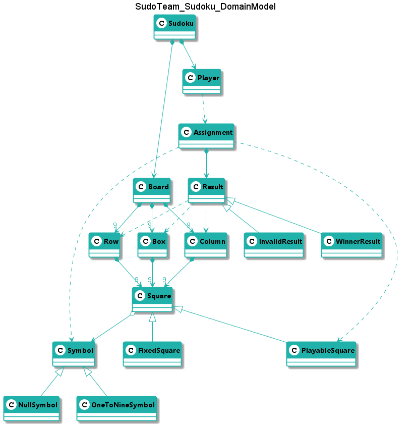

# Sudoku
Práctica Máster Desarrollo Julio - SudokuTeam

**Índice**

1. [¿Cómo se juega el sudoku paso a paso?](#video)
2. [Modelo del dominio](#modelo-del-dominio)   
3. [Interfaz Gráfico](#interfaz-gráfico)
## Video Explicativo

[](https://www.youtube.com/watch?v=LET73Mnm0wY)

## Modelo del dominio  
  
  
  
## Intefaz Gráfico

```
--- SUDOKU ---

   ╔═══════════╦═══════════╦═══════════╗
 9 ║ 5 | 3 |   ║   | 7 |   ║   |   |   ║
   ║───┼───┼───║───┼───┼───║───┼───┼───║
 8 ║ 6 |   |   ║ 1 | 9 | 5 ║   |   |   ║
   ║───┼───┼───║───┼───┼───║───┼───┼───║
 7 ║   | 9 | 8 ║   |   |   ║   | 6 |   ║
   ╠═══════════╬═══════════╬═══════════╣
 6 ║ 8 |   |   ║   | 6 |   ║   |   | 3 ║
   ║───┼───┼───║───┼───┼───║───┼───┼───║
 5 ║ 4 |   |   ║ 8 |   | 3 ║   |   | 1 ║
   ║───┼───┼───║───┼───┼───║───┼───┼───║
 4 ║ 7 |   |   ║   | 2 |   ║   |   | 6 ║
   ╠═══════════╬═══════════╬═══════════╣
 3 ║   | 6 |   ║   |   |   ║ 2 | 8 |   ║
   ║───┼───┼───║───┼───┼───║───┼───┼───║
 2 ║   |   |   ║ 4 | 1 | 9 ║   |   | 5 ║
   ║───┼───┼───║───┼───┼───║───┼───┼───║
 1 ║   |   |   ║   | 8 |   ║   | 7 | 9 ║
   ╚═══════════╩═══════════╩═══════════╝
     A   B   C   D   E   F   G   H   I

Select coordinate to assign: K10
 * Wrong coordinate
Select coordinate to assign: H7
 * This coordinate has a fixed value
Select coordinate to assign: H8
Enter a number: 10
 * Not a valid number {1..9}
Enter a number: 2

   ╔═══════════╦═══════════╦═══════════╗
 9 ║ 5 | 3 |   ║   | 7 |   ║   |   |   ║
   ║───┼───┼───║───┼───┼───║───┼───┼───║
 8 ║ 6 |   |   ║ 1 | 9 | 5 ║   | 2 |   ║
   ║───┼───┼───║───┼───┼───║───┼───┼───║
 7 ║   | 9 | 8 ║   |   |   ║   | 6 |   ║
   ╠═══════════╬═══════════╬═══════════╣
 6 ║ 8 |   |   ║   | 6 |   ║   |   | 3 ║
   ║───┼───┼───║───┼───┼───║───┼───┼───║
 5 ║ 4 |   |   ║ 8 |   | 3 ║   |   | 1 ║
   ║───┼───┼───║───┼───┼───║───┼───┼───║
 4 ║ 7 |   |   ║   | 2 |   ║   |   | 6 ║
   ╠═══════════╬═══════════╬═══════════╣
 3 ║   | 6 |   ║   |   |   ║ 2 | 8 |   ║
   ║───┼───┼───║───┼───┼───║───┼───┼───║
 2 ║   |   |   ║ 4 | 1 | 9 ║   |   | 5 ║
   ║───┼───┼───║───┼───┼───║───┼───┼───║
 1 ║   |   |   ║   | 8 |   ║   | 7 | 9 ║
   ╚═══════════╩═══════════╩═══════════╝
     A   B   C   D   E   F   G   H   I

Select coordinate to assign: B2
Enter a number: 8

   ╔═══════════╦═══════════╦═══════════╗
 9 ║ 5 | 3 |   ║   | 7 |   ║   |   |   ║
   ║───┼───┼───║───┼───┼───║───┼───┼───║
 8 ║ 6 |   |   ║ 1 | 9 | 5 ║   | 2 |   ║
   ║───┼───┼───║───┼───┼───║───┼───┼───║
 7 ║   | 9 | 8 ║   |   |   ║   | 6 |   ║
   ╠═══════════╬═══════════╬═══════════╣
 6 ║ 8 |   |   ║   | 6 |   ║   |   | 3 ║
   ║───┼───┼───║───┼───┼───║───┼───┼───║
 5 ║ 4 |   |   ║ 8 |   | 3 ║   |   | 1 ║
   ║───┼───┼───║───┼───┼───║───┼───┼───║
 4 ║ 7 |   |   ║   | 2 |   ║   |   | 6 ║
   ╠═══════════╬═══════════╬═══════════╣
 3 ║   | 6 |   ║   |   |   ║ 2 | 8 |   ║
   ║───┼───┼───║───┼───┼───║───┼───┼───║
 2 ║   | 8 |   ║ 4 | 1 | 9 ║   |   | 5 ║
   ║───┼───┼───║───┼───┼───║───┼───┼───║
 1 ║   |   |   ║   | 8 |   ║   | 7 | 9 ║
   ╚═══════════╩═══════════╩═══════════╝
     A   B   C   D   E   F   G   H   I

Select coordinate to assign: H8
Enter a number: 7
 * Number 7 has already been assigned at this column.
Enter a number: 1
 * Number 1 has already been assigned at this row.
Enter a number: 6
 * Number 1 has already been assigned at this grid.
Enter a number: 4

   ╔═══════════╦═══════════╦═══════════╗
 9 ║ 5 | 3 |   ║   | 7 |   ║   |   |   ║
   ║───┼───┼───║───┼───┼───║───┼───┼───║
 8 ║ 6 |   |   ║ 1 | 9 | 5 ║   | 4 |   ║
   ║───┼───┼───║───┼───┼───║───┼───┼───║
 7 ║   | 9 | 8 ║   |   |   ║   | 6 |   ║
   ╠═══════════╬═══════════╬═══════════╣
 6 ║ 8 |   |   ║   | 6 |   ║   |   | 3 ║
   ║───┼───┼───║───┼───┼───║───┼───┼───║
 5 ║ 4 |   |   ║ 8 |   | 3 ║   |   | 1 ║
   ║───┼───┼───║───┼───┼───║───┼───┼───║
 4 ║ 7 |   |   ║   | 2 |   ║   |   | 6 ║
   ╠═══════════╬═══════════╬═══════════╣
 3 ║   | 6 |   ║   |   |   ║ 2 | 8 |   ║
   ║───┼───┼───║───┼───┼───║───┼───┼───║
 2 ║   | 8 |   ║ 4 | 1 | 9 ║   |   | 5 ║
   ║───┼───┼───║───┼───┼───║───┼───┼───║
 1 ║   |   |   ║   | 8 |   ║   | 7 | 9 ║
   ╚═══════════╩═══════════╩═══════════╝
     A   B   C   D   E   F   G   H   I

.....................
.....................
.....................

   ╔═══════════╦═══════════╦═══════════╗
 9 ║ 5 | 3 | 4 ║ 6 | 7 | 8 ║ 9 | 1 | 2 ║
   ║───┼───┼───║───┼───┼───║───┼───┼───║
 8 ║ 6 | 7 | 2 ║ 1 | 9 | 5 ║ 3 | 4 | 8 ║
   ║───┼───┼───║───┼───┼───║───┼───┼───║
 7 ║ 1 | 9 | 8 ║ 3 | 4 | 2 ║ 5 | 6 | 7 ║
   ╠═══════════╬═══════════╬═══════════╣
 6 ║ 8 | 5 | 9 ║ 7 | 6 | 1 ║   | 2 | 3 ║
   ║───┼───┼───║───┼───┼───║───┼───┼───║
 5 ║ 4 | 2 | 6 ║ 8 | 5 | 3 ║ 7 | 9 | 1 ║
   ║───┼───┼───║───┼───┼───║───┼───┼───║
 4 ║ 7 | 1 | 3 ║ 9 | 2 | 4 ║ 8 | 5 | 6 ║
   ╠═══════════╬═══════════╬═══════════╣
 3 ║ 9 | 6 | 1 ║ 5 | 3 | 7 ║ 2 | 8 | 4 ║
   ║───┼───┼───║───┼───┼───║───┼───┼───║
 2 ║ 2 | 8 | 7 ║ 4 | 1 | 9 ║ 6 | 3 | 5 ║
   ║───┼───┼───║───┼───┼───║───┼───┼───║
 1 ║ 3 | 4 | 5 ║ 2 | 8 | 6 ║ 1 | 7 | 9 ║
   ╚═══════════╩═══════════╩═══════════╝
     A   B   C   D   E   F   G   H   I

Select coordinate to assign: G6
Enter a number: 4

   ╔═══════════╦═══════════╦═══════════╗
 9 ║ 5 | 3 | 4 ║ 6 | 7 | 8 ║ 9 | 1 | 2 ║
   ║───┼───┼───║───┼───┼───║───┼───┼───║
 8 ║ 6 | 7 | 2 ║ 1 | 9 | 5 ║ 3 | 4 | 8 ║
   ║───┼───┼───║───┼───┼───║───┼───┼───║
 7 ║ 1 | 9 | 8 ║ 3 | 4 | 2 ║ 5 | 6 | 7 ║
   ╠═══════════╬═══════════╬═══════════╣
 6 ║ 8 | 5 | 9 ║ 7 | 6 | 1 ║ 4 | 2 | 3 ║
   ║───┼───┼───║───┼───┼───║───┼───┼───║
 5 ║ 4 | 2 | 6 ║ 8 | 5 | 3 ║ 7 | 9 | 1 ║
   ║───┼───┼───║───┼───┼───║───┼───┼───║
 4 ║ 7 | 1 | 3 ║ 9 | 2 | 4 ║ 8 | 5 | 6 ║
   ╠═══════════╬═══════════╬═══════════╣
 3 ║ 9 | 6 | 1 ║ 5 | 3 | 7 ║ 2 | 8 | 4 ║
   ║───┼───┼───║───┼───┼───║───┼───┼───║
 2 ║ 2 | 8 | 7 ║ 4 | 1 | 9 ║ 6 | 3 | 5 ║
   ║───┼───┼───║───┼───┼───║───┼───┼───║
 1 ║ 3 | 4 | 5 ║ 2 | 8 | 6 ║ 1 | 7 | 9 ║
   ╚═══════════╩═══════════╩═══════════╝
     A   B   C   D   E   F   G   H   I

You win!!! :-)
Do you want to continue? (y/n):
```
```
