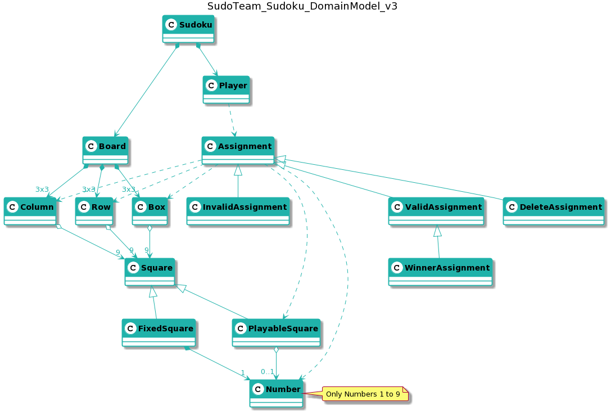
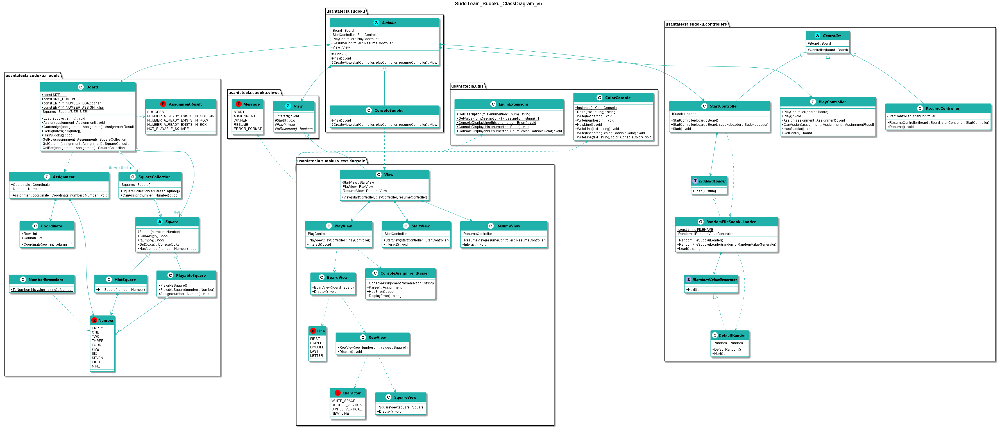

# Sudoku
Práctica Máster Desarrollo Julio - SudokuTeam

**Índice**

1. [¿Cómo se juega el sudoku paso a paso?](#video-explicativo)
2. [Modelo del dominio](#modelo-del-dominio)  
3. [Diagrama de clases](#Diagrama-de-clases)  
4. [Prototipo de Interfaz](#prototipo-de-interfaz)
## Video Explicativo

[](https://www.youtube.com/watch?v=LET73Mnm0wY)

## Modelo del dominio  
  
  
  
## Diagrama de clases  
  
  
  
## Prototipo de Interfaz

```

---------------- SUDOKU ----------------

   ╔═══════════╦═══════════╦═══════════╗
 9 ║ 5 | 3 |   ║   | 7 |   ║   |   |   ║
   ║───┼───┼───║───┼───┼───║───┼───┼───║
 8 ║ 6 |   |   ║ 1 | 9 | 5 ║   |   |   ║
   ║───┼───┼───║───┼───┼───║───┼───┼───║
 7 ║   | 9 | 8 ║   |   |   ║   | 6 |   ║
   ╠═══════════╬═══════════╬═══════════╣
 6 ║ 8 |   |   ║   | 6 |   ║   |   | 3 ║
   ║───┼───┼───║───┼───┼───║───┼───┼───║
 5 ║ 4 |   |   ║ 8 |   | 3 ║   |   | 1 ║
   ║───┼───┼───║───┼───┼───║───┼───┼───║
 4 ║ 7 |   |   ║   | 2 |   ║   |   | 6 ║
   ╠═══════════╬═══════════╬═══════════╣
 3 ║   | 6 |   ║   |   |   ║ 2 | 8 |   ║
   ║───┼───┼───║───┼───┼───║───┼───┼───║
 2 ║   |   |   ║ 4 | 1 | 9 ║   |   | 5 ║
   ║───┼───┼───║───┼───┼───║───┼───┼───║
 1 ║   |   |   ║   | 8 |   ║   | 7 | 9 ║
   ╚═══════════╩═══════════╩═══════════╝
     A   B   C   D   E   F   G   H   I

Select a square to assign: K10+3
 * Not a valid format:
        Assign: [A..I][1..9]+[1..9]
        Remove: [A..I][1..9]-
        
Select a square to assign: H8+10
 * Not a valid format:
        Assign: [A..I][1..9]+[1..9]
        Remove: [A..I][1..9]-
        
Select a square to assign: H7+1
 * This square has a fixed value
 
Select a square to assign: H8+2

   ╔═══════════╦═══════════╦═══════════╗
 9 ║ 5 | 3 |   ║   | 7 |   ║   |   |   ║
   ║───┼───┼───║───┼───┼───║───┼───┼───║
 8 ║ 6 |   |   ║ 1 | 9 | 5 ║   | 2 |   ║
   ║───┼───┼───║───┼───┼───║───┼───┼───║
 7 ║   | 9 | 8 ║   |   |   ║   | 6 |   ║
   ╠═══════════╬═══════════╬═══════════╣
 6 ║ 8 |   |   ║   | 6 |   ║   |   | 3 ║
   ║───┼───┼───║───┼───┼───║───┼───┼───║
 5 ║ 4 |   |   ║ 8 |   | 3 ║   |   | 1 ║
   ║───┼───┼───║───┼───┼───║───┼───┼───║
 4 ║ 7 |   |   ║   | 2 |   ║   |   | 6 ║
   ╠═══════════╬═══════════╬═══════════╣
 3 ║   | 6 |   ║   |   |   ║ 2 | 8 |   ║
   ║───┼───┼───║───┼───┼───║───┼───┼───║
 2 ║   |   |   ║ 4 | 1 | 9 ║   |   | 5 ║
   ║───┼───┼───║───┼───┼───║───┼───┼───║
 1 ║   |   |   ║   | 8 |   ║   | 7 | 9 ║
   ╚═══════════╩═══════════╩═══════════╝
     A   B   C   D   E   F   G   H   I

Select a square to assign: B2+8

   ╔═══════════╦═══════════╦═══════════╗
 9 ║ 5 | 3 |   ║   | 7 |   ║   |   |   ║
   ║───┼───┼───║───┼───┼───║───┼───┼───║
 8 ║ 6 |   |   ║ 1 | 9 | 5 ║   | 2 |   ║
   ║───┼───┼───║───┼───┼───║───┼───┼───║
 7 ║   | 9 | 8 ║   |   |   ║   | 6 |   ║
   ╠═══════════╬═══════════╬═══════════╣
 6 ║ 8 |   |   ║   | 6 |   ║   |   | 3 ║
   ║───┼───┼───║───┼───┼───║───┼───┼───║
 5 ║ 4 |   |   ║ 8 |   | 3 ║   |   | 1 ║
   ║───┼───┼───║───┼───┼───║───┼───┼───║
 4 ║ 7 |   |   ║   | 2 |   ║   |   | 6 ║
   ╠═══════════╬═══════════╬═══════════╣
 3 ║   | 6 |   ║   |   |   ║ 2 | 8 |   ║
   ║───┼───┼───║───┼───┼───║───┼───┼───║
 2 ║   | 8 |   ║ 4 | 1 | 9 ║   |   | 5 ║
   ║───┼───┼───║───┼───┼───║───┼───┼───║
 1 ║   |   |   ║   | 8 |   ║   | 7 | 9 ║
   ╚═══════════╩═══════════╩═══════════╝
     A   B   C   D   E   F   G   H   I


Select a square to assign: H8-

   ╔═══════════╦═══════════╦═══════════╗
 9 ║ 5 | 3 |   ║   | 7 |   ║   |   |   ║
   ║───┼───┼───║───┼───┼───║───┼───┼───║
 8 ║ 6 |   |   ║ 1 | 9 | 5 ║   |   |   ║
   ║───┼───┼───║───┼───┼───║───┼───┼───║
 7 ║   | 9 | 8 ║   |   |   ║   | 6 |   ║
   ╠═══════════╬═══════════╬═══════════╣
 6 ║ 8 |   |   ║   | 6 |   ║   |   | 3 ║
   ║───┼───┼───║───┼───┼───║───┼───┼───║
 5 ║ 4 |   |   ║ 8 |   | 3 ║   |   | 1 ║
   ║───┼───┼───║───┼───┼───║───┼───┼───║
 4 ║ 7 |   |   ║   | 2 |   ║   |   | 6 ║
   ╠═══════════╬═══════════╬═══════════╣
 3 ║   | 6 |   ║   |   |   ║ 2 | 8 |   ║
   ║───┼───┼───║───┼───┼───║───┼───┼───║
 2 ║   | 8 |   ║ 4 | 1 | 9 ║   |   | 5 ║
   ║───┼───┼───║───┼───┼───║───┼───┼───║
 1 ║   |   |   ║   | 8 |   ║   | 7 | 9 ║
   ╚═══════════╩═══════════╩═══════════╝
     A   B   C   D   E   F   G   H   I

Select a square to assign: H8+7
 * Number has already been assigned at this column.
 
Select a square to assign: H8+1
 * Number has already been assigned at this row.
 
Select a square to assign: H8+6
 * Number has already been assigned at this box.
 
Select a square to assign: H8+4

   ╔═══════════╦═══════════╦═══════════╗
 9 ║ 5 | 3 |   ║   | 7 |   ║   |   |   ║
   ║───┼───┼───║───┼───┼───║───┼───┼───║
 8 ║ 6 |   |   ║ 1 | 9 | 5 ║   | 4 |   ║
   ║───┼───┼───║───┼───┼───║───┼───┼───║
 7 ║   | 9 | 8 ║   |   |   ║   | 6 |   ║
   ╠═══════════╬═══════════╬═══════════╣
 6 ║ 8 |   |   ║   | 6 |   ║   |   | 3 ║
   ║───┼───┼───║───┼───┼───║───┼───┼───║
 5 ║ 4 |   |   ║ 8 |   | 3 ║   |   | 1 ║
   ║───┼───┼───║───┼───┼───║───┼───┼───║
 4 ║ 7 |   |   ║   | 2 |   ║   |   | 6 ║
   ╠═══════════╬═══════════╬═══════════╣
 3 ║   | 6 |   ║   |   |   ║ 2 | 8 |   ║
   ║───┼───┼───║───┼───┼───║───┼───┼───║
 2 ║   | 8 |   ║ 4 | 1 | 9 ║   |   | 5 ║
   ║───┼───┼───║───┼───┼───║───┼───┼───║
 1 ║   |   |   ║   | 8 |   ║   | 7 | 9 ║
   ╚═══════════╩═══════════╩═══════════╝
     A   B   C   D   E   F   G   H   I

.....................
.....................
.....................

   ╔═══════════╦═══════════╦═══════════╗
 9 ║ 5 | 3 | 4 ║ 6 | 7 | 8 ║ 9 | 1 | 2 ║
   ║───┼───┼───║───┼───┼───║───┼───┼───║
 8 ║ 6 | 7 | 2 ║ 1 | 9 | 5 ║ 3 | 4 | 8 ║
   ║───┼───┼───║───┼───┼───║───┼───┼───║
 7 ║ 1 | 9 | 8 ║ 3 | 4 | 2 ║ 5 | 6 | 7 ║
   ╠═══════════╬═══════════╬═══════════╣
 6 ║ 8 | 5 | 9 ║ 7 | 6 | 1 ║   | 2 | 3 ║
   ║───┼───┼───║───┼───┼───║───┼───┼───║
 5 ║ 4 | 2 | 6 ║ 8 | 5 | 3 ║ 7 | 9 | 1 ║
   ║───┼───┼───║───┼───┼───║───┼───┼───║
 4 ║ 7 | 1 | 3 ║ 9 | 2 | 4 ║ 8 | 5 | 6 ║
   ╠═══════════╬═══════════╬═══════════╣
 3 ║ 9 | 6 | 1 ║ 5 | 3 | 7 ║ 2 | 8 | 4 ║
   ║───┼───┼───║───┼───┼───║───┼───┼───║
 2 ║ 2 | 8 | 7 ║ 4 | 1 | 9 ║ 6 | 3 | 5 ║
   ║───┼───┼───║───┼───┼───║───┼───┼───║
 1 ║ 3 | 4 | 5 ║ 2 | 8 | 6 ║ 1 | 7 | 9 ║
   ╚═══════════╩═══════════╩═══════════╝
     A   B   C   D   E   F   G   H   I

Select a square to assign: G6+4

   ╔═══════════╦═══════════╦═══════════╗
 9 ║ 5 | 3 | 4 ║ 6 | 7 | 8 ║ 9 | 1 | 2 ║
   ║───┼───┼───║───┼───┼───║───┼───┼───║
 8 ║ 6 | 7 | 2 ║ 1 | 9 | 5 ║ 3 | 4 | 8 ║
   ║───┼───┼───║───┼───┼───║───┼───┼───║
 7 ║ 1 | 9 | 8 ║ 3 | 4 | 2 ║ 5 | 6 | 7 ║
   ╠═══════════╬═══════════╬═══════════╣
 6 ║ 8 | 5 | 9 ║ 7 | 6 | 1 ║ 4 | 2 | 3 ║
   ║───┼───┼───║───┼───┼───║───┼───┼───║
 5 ║ 4 | 2 | 6 ║ 8 | 5 | 3 ║ 7 | 9 | 1 ║
   ║───┼───┼───║───┼───┼───║───┼───┼───║
 4 ║ 7 | 1 | 3 ║ 9 | 2 | 4 ║ 8 | 5 | 6 ║
   ╠═══════════╬═══════════╬═══════════╣
 3 ║ 9 | 6 | 1 ║ 5 | 3 | 7 ║ 2 | 8 | 4 ║
   ║───┼───┼───║───┼───┼───║───┼───┼───║
 2 ║ 2 | 8 | 7 ║ 4 | 1 | 9 ║ 6 | 3 | 5 ║
   ║───┼───┼───║───┼───┼───║───┼───┼───║
 1 ║ 3 | 4 | 5 ║ 2 | 8 | 6 ║ 1 | 7 | 9 ║
   ╚═══════════╩═══════════╩═══════════╝
     A   B   C   D   E   F   G   H   I

You win!!! :-)
Do you want to continue? (y/n):
```
